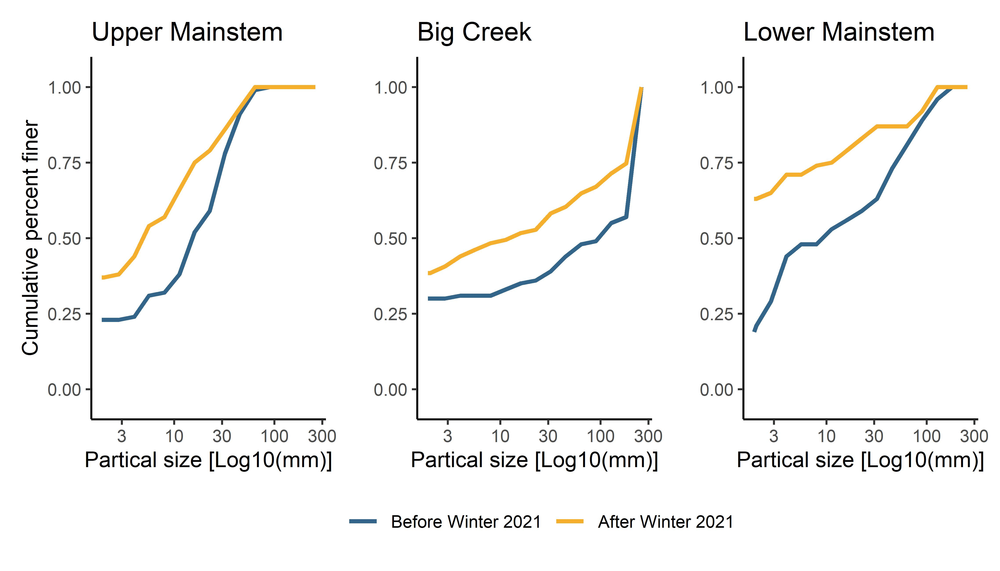
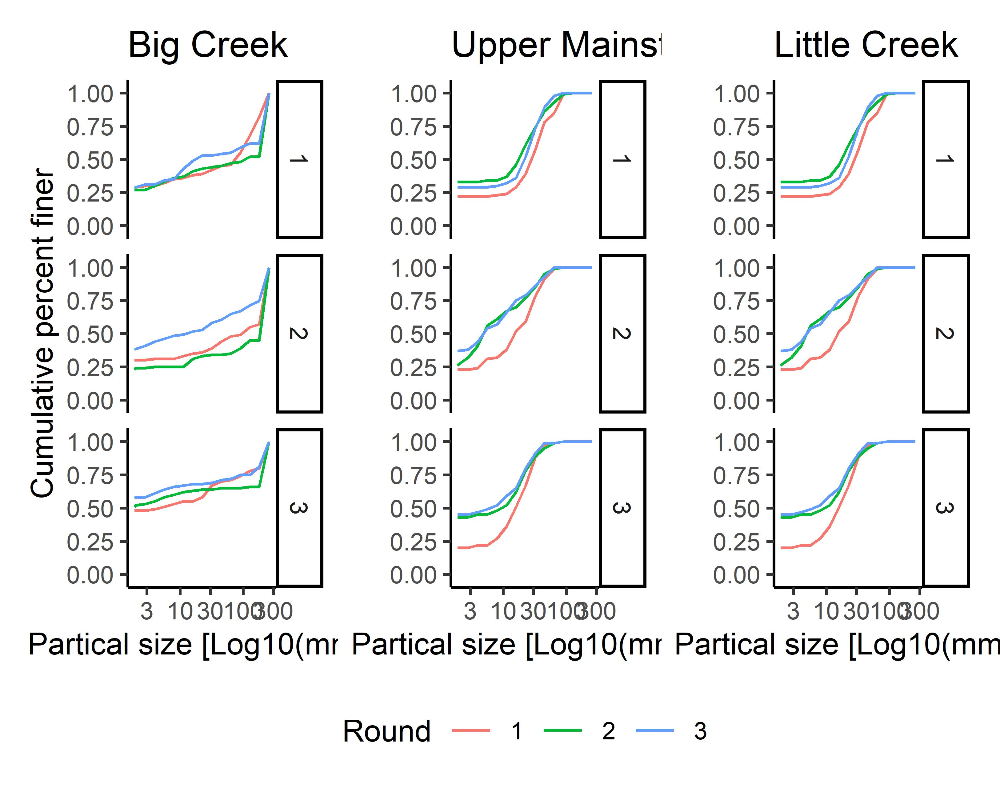
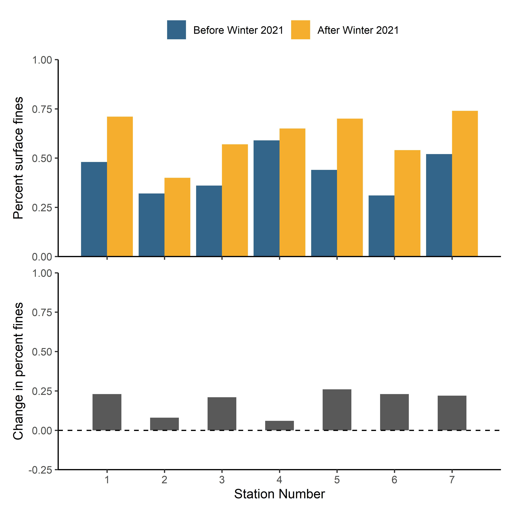
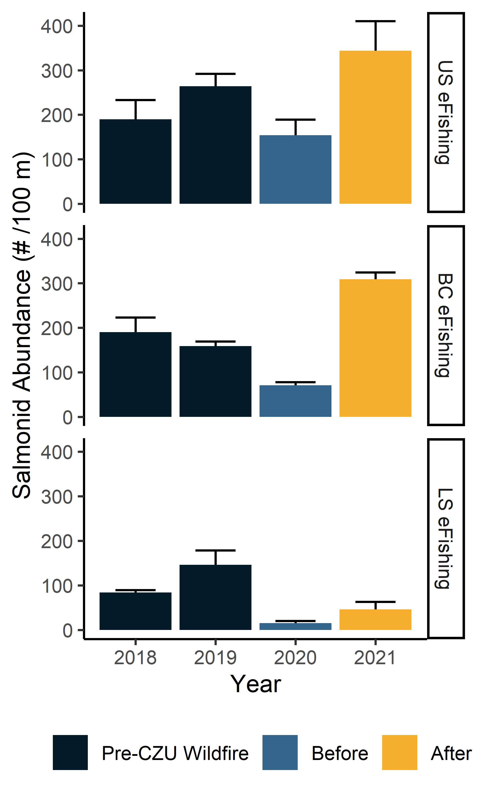
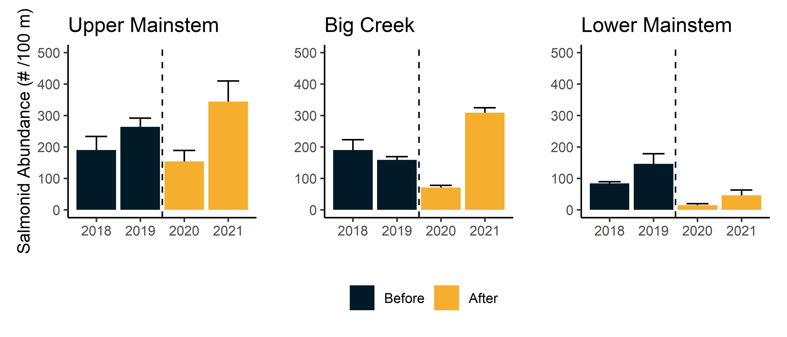
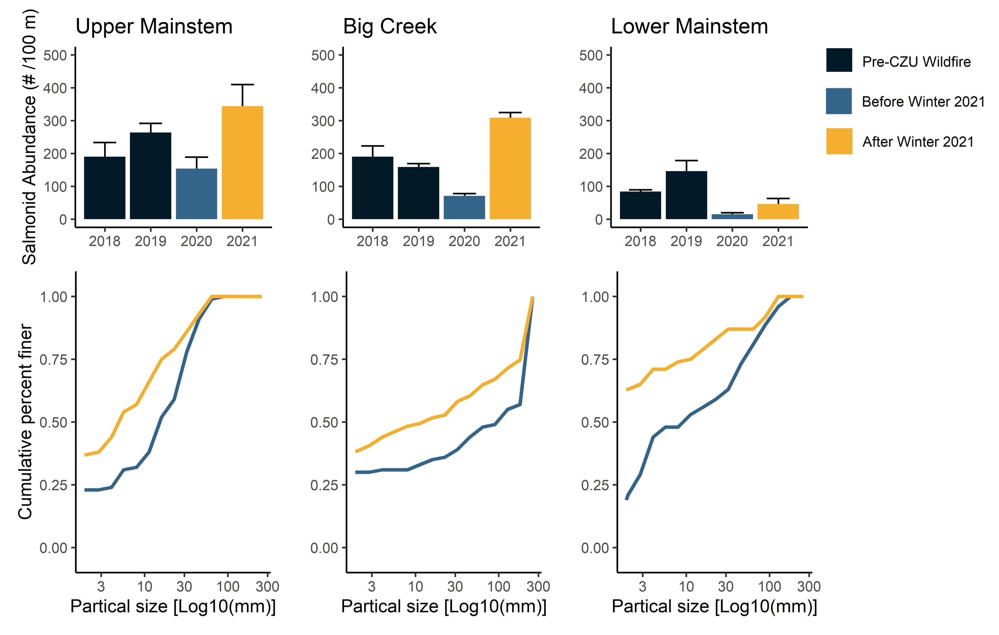
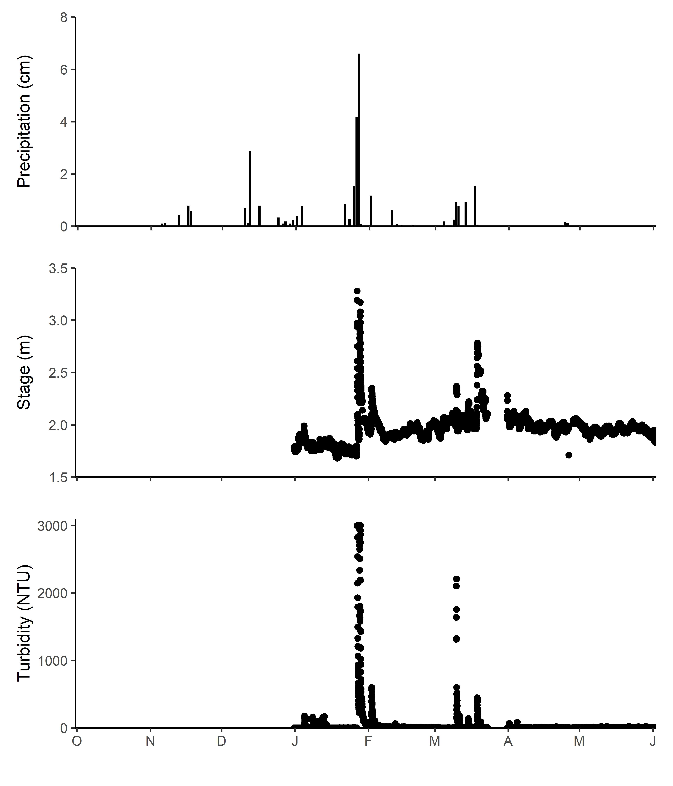

<!-- README.md is generated from README.Rmd. Please edit that file -->

```{r, echo = FALSE}
knitr::opts_chunk$set(
  collapse = TRUE,
  comment = "#>"
)
```


## Introduction

 

In August 2020, the CZU Lightning Complex fire burned more than 350 km2 (86,500 acres) of coastal forests and hills in the Santa Cruz Mountains region (Red outline in right figure; Santa Cruz and San Mateo counties, California). Among the watersheds severely affected by wildfire was Scott Creek (Yellow outline in right figure), a small (70 km2) coastal basin ~80 km south of San Francisco Bay. The Scott Creek watershed is of special management concern as it supports the southernmost extant population of coho salmon (*Oncorhynchus kisutch*; Central California Coast [CCC] evolutionarily significant unit) in North America, as well as federally threatened CCC steelhead (anadramous *O. mykiss*). Scott Creek is also the location of a salmonid life cycle monitoring station operated jointly by NOAA’s Southwest Fisheries Science Center and the University of California, Santa Cruz. Extensive physical, chemical, and biological monitoring conducted throughout the Scott Creek watershed since 2002 provides a unique opportunity to rigorously examine the direct and indirect effects of wildfire on salmonid productivity and carrying capacity.

## Readme File Purpose
This readme file consists of an overview of the datasets, goals, and data visualizations used in the  AGU Fall 2021 Poster (December 2021; WY2022). The goal was to visualize conditions 1 year after the 2020 CZU Fire in the Scott Creek watershed (Santa Cruz, CA). Datasets include: pebble counts, and [Add more details here]. Each dataset has a unique scipt (.R file) where the data wrangling, analysis, and data visualization occurs. The "source" function has been included in this readme file to incorperate the individual scripts if desired (they are currently commented out for simplicity).   

<br>

**Dataset Descriptions** 


The <span style="color:purple">*Data*</span> folder contains the datasets used in the poster.

1. The <span style="color:purple">*Scott_Creek_Pebble_20211115.csv*</span> datafile consists of pebble counts at 23 transects accrost the watershed (6 eFishing sites with 3 transects each, and 5 additional pebble count only transects) which were repeated twice (Autumn 2020 & Summer 2021). AC and MA entered the data. There was some sort of typo which hopefully is now fixed. 

2. The <span style="color:purple">*Efishing_totalpop_20211206.csv*</span> datafile contains 3 pass depletion eFsihing at the Lower mainstem, Upper mainstem, and Big Creek "Sue" sites provided by K. Kobayashi. The FSA package was used to then generate population estimates when then updated the total pop datafile below.

3. The <span style="color:purple">*Efishing_totalpop_20211206.csv*</span> datafile is the FSA package output (population estimate, SD, and 95%CI) for each site. Note the FSA code below is repeated for 3 pass and 2 cases of 4 pass sampling. This datafile is a compination of output generated form the WY21 Poster (Historic data were queried by JK on 5 April 2021 and WY 2021 data Count of total number of individuals and pass were generated using pivot tables. Note: eFishing sampling events were limmited to August - November periods (Additional June/July sampling events exists).) and WY21 data were provided by K. Kobayashi.

4. The <span style="color:purple">*Precip_20211207.csv*</span> datafile contains WY21 daily precipitation for Santa Cruz, CA from the [Weather Cat Website](http://www.weathercat.net/wxraindetail.php). Date range 10/1/20 to 9/31/21.

5. The <span style="color:purple">*Scott_Creek_Weir_Hydrolab_20210101_to_20210622.csv*</span> datafile contains a snippbet (incomplete dataset) of the water quality data collected by the HYDROLAB (S/N 66279, model DS5X). The unit is installed directly above the weir. It collects depth, temp, salinity, turbidity, (and other) every half hour. Note there is some column renaming done before importing the dataset into R. Data range from 1/1/2021 to 6/22/21. <span style="color:red">*Dataset has been lightly QC'ed and may need additional work.*</span> 

6. The <span style="color:purple">*Gagedata_XXX.csv*</span> datafile contains a portion of the stage(timestamp and ft) data. The unit is installed near the Archibald Creek confluence with the mainstem. The agge wasn't workig very well during WY21 (data collected every 2 hrs and would get clogged with fine sediment). Ryan Sercy (Standford) has recreated the hydrograph from regression nearby gages. <span style="color:red">*We decided to not include this data in the poster.*</span> 

<br>

**Plot Theme Notes** 

* The colors "#33658a" (blue) and "#f26419" (orange) are used to designate data collected before and after the fire, respectively. #f6ae2d (yellow) represents the first flush (Round 2) data. Colors are part of this [iColorpalette](https:\\iColorpalette.com\p\222275).

```{r Manual colorway for before and after, echo = FALSE}
# scale_fill_manual(values = c("#011a27", "#e6df44"), labels = c("Before", "After")) 
```
<br>

## Workflow Steps

**Pebble Count Dataset** 

1. Decide on which pebble count rounds to present (likely round 1 and 3), 

2. Generate pebble count summaries (% Fines, D50).

3. Plot summaries (percent fines boxplots).


**eFishing Dataset** 

1. Generate population estimates and CI using FSA package.

2. Plot population estimates over time.


**WQ Dataset** 

1. Plot precipitation over WY21.

2. Plot turbidity over WY 21.

3. Plot hydrograph over WY21 (using R. Sercy dataset?).


```{r Package Setup, echo = FALSE, message = FALSE}
library(tidyverse)
library(dplyr)
library(lubridate)
# library(ggplot2)
library(patchwork)

```

<br>

## Pebble Counts 

**Goals**: 

1. Visualize the sediment distributions at each site/transect. (Data needs to be manipulated from size class counts (summaries) to individual pebbles).

2. Estimate the change in the amount of surface fines at each transect (reported as % change over time). Note: The cuttoff for "fines" in the litterature is a bit ambiguous. For now we will stick with "fines" meaning <6mm (though <8mm could also been used).

3. Compare how different surface summary statistics (i.e. Dx) changed 1 year post fire at 1.A each site and 1.B longitudinally along the mainstem and Big Creek.

* There are some example papers vizualizing pebble count data in the CZU fire google drive [pebble count folder](https://drive.google.com/drive/u/1/folders/1MwYFVTyhN1_3NMqhlwIAu8DBYOm8KzSo).


**Script**: 1_Pebble_Count_Data.R

**Dataset name**: pc

**Variable descriptions**:

* Date = Sample date (format = YYYY-MM-DD).

* Site = Site name (“___ eFishing” or “PCX-__”).

* Transect = Transect number (1,2,3 for eFishing sites or blank for PCX sites).

* Round = Survey round (1 = Autumn 2020, 2 = Winter 2021).

* Long_Station = Longitude Station (1 = Lower eFishing, 2 = PCX-1, 3 = PCX-2, 4 = PCX-4, 5 = PCX-5, 6 = Upper eFishing, 7 = Dog eFishing, 8 = PCX-3, 9 = Big Creek eFishing, 10 = Powerhouse eFishing, 11 = Little Creek eFishing).

* Size_class_mm = Size class (mm), gevelometer hole the pebble *did not* fit though.

* Category_total = Total number of pebbles in the size class.

* Percent_finer = Cumulative percent finer for each size class. This is used for calculating the Dx statistic. 


```{r Pebble Count Code source, echo = FALSE}

#To run the WQ script directly in this .rmd file use the function below
#source("3_Pebble_Count_Data.R", local = knitr::knit_global())

```

<br>

**Cumulative percent finer plots for the eFishing sites**

Each eFishing site plot: each panel (facet) is a transect and line color denotes the two survey rounds (blue is before winter, gold is after first flush). The starting place and slope of each line gives you an idea of the sediment distribution. "Shifts in the lower end of the pebble count cumulative frequency curves are indicative of significant increases in streambed fines" (Potyondy and Hardy 1994). If the gold line starts above the blue line, the surface sediment became finer after the first flush.

Potyondy and Hardy (1994) reccomend, "statistical comparison of particle size distributions can be done with 2 x 2 contingency tables (number of pebbles less than 6 mm versus the number of pebbles greater than or equal to 6 mm) and the likelihood ratio Chi-square statistic to compare one frequency distribution with another (King and Potyondy, 1993)."





<br>

**Percent fines (<6mm) and change in percent fines along the mainstem**


<br>

**Boxplots and stat tests of percent surface fines (before and 1 year post fire)**

<br>

**Sediment Distribution Plots**

Distribution plots can help answer the question, "Are the data symmetrically distributed or are they concentrated in one or more size classes?" To look at distributions the data need to have a row for each observation ("tidy" data format).

Before we can plot the distribution, the pebble count input data needs to be "expanded" from size class *totals* to *individual* pebble counts by duplicating rows of values. 

<br>

**Find gransize at percentiles**

Colin Nicol has generously shared his code to help with this. He created a function which interpolates a straight line between the two points nearest to the desired percentile `Dx`. Using the data provided, the function looks for the minimum grain size where the percent finer is greater than `Dx`. Then it calculates the slope between those two lines. From here, it uses the slope and the `rise` to get to 50% to calculate a `run` (distance on the x-axis `grain size` we need to move from the known point to `D50`).   

```{r Pebble Count Summary Stats (Dx)}

#Pebble Count Summary Stat code from C. Nicol :)

calculate_dx <- function(dx, size, prcnt_finer) {
  # Purpose: Calculate the grainsize for a given percentile
  # Method: Interpolate a straight line between the two bounding points
  # Input:  df - Dataframe with percent finer than data, dx - desired output percentile
  
  # Output: Grainsize at dx
  
  dx <- dx/100
  
  data.frame(size = size, prcnt_finer = prcnt_finer) %>%
    mutate(abovex = min(size[prcnt_finer > dx]),
           lessx = max(size[prcnt_finer <= dx])) %>%
    filter(size %in% c(abovex, lessx)) %>%
    mutate(slope = (max(prcnt_finer) - min(prcnt_finer)) / (max(size) - min(size))) %>%
    filter(size == lessx) %>%
    mutate(run = (dx - prcnt_finer) / slope,
           dx_size = size + run,
           dx = dx * 100) %>%
    pull(dx_size)
  
}

#Call in what you want to calculate. In this case its the median grain size (D50) of the test dataset (one site). 

# calculate_dx(50, pc.test$Size_class_mm, pc.test$Percent_finer)

#Note, it will give you an error if the first category (i.e. <2mm) is greater than the percential you want to calculate.

# calculate_dx(16, pc.test$Size_class_mm, pc.test$Percent_finer) #error generated becuase you want to calculate the D16 and <2mm is 40% of the sample.

#Once we have this function set up, loop through D16, D50 and D84 for the one site.
# dxs <- c(16, 50, 84) # choose which percentiles to calculate (e.g. D16, D50, D84)
# 
# names(dxs) <- paste0('d', dxs)
# 
# sapply(dxs, calculate_dx, size = pc.test$Size_class_mm, prcnt_finer = pc.test$Percent_finer)


# Calculate summary stats for multiple transects all at once
#Test dataset
# pc.test <- pc.test %>%
#   summarize(
#     d50 = calculate_dx(50, size = pc.test$Size_class_mm, prcnt_finer = pc.test$Percent_finer),
#     d84 = calculate_dx(84, size = pc.test$Size_class_mm, prcnt_finer = pc.test$Percent_finer))

####START HERE####
#NOT WORKING FOR THE WHOLE DATASET!
####

# pc.x <- pc %>%
#   # group_by(Site, Transect, Round) %>% # Creates a unique grouping variable
#   summarize(
#             # d16 = calculate_dx(16, size = pc.test$Size_class_mm, prcnt_finer = pc.test$Percent_finer),
#     d50 = calculate_dx(50, size = pc$Size_class_mm, prcnt_finer = pc$Percent_finer),
#     d84 = calculate_dx(84, size = pc$Size_class_mm, prcnt_finer = pc$Percent_finer))

```

<br>

##  eFishing Population Estimates 

**Goals**: 

1. Generate population estimates and CI using FSA package (Simple Fisheries Stock Assessment Methods package).

2. Plot population estimates over time.


**Script**: 4_eFishing_Data.R


**Dataset name**: fish


**Variable descriptions**:

* ID = unique ID (for loop function)

* Date = Sample date (format = YYYY-MM-DD).

* Site = Site name

* Species = Coho or Steelhead

* P1 = Pass 1 count

* P2 = Pass 2 count

* P3 = Pass 3 count

* P4 = Pass 4 count (special case)

* fire = True for 2020 onwards, False for all years before the fire (used for color coding plots).



<br>

<br>



##  Turbidity, Precipitation, & Flow data visualization


**Goal**: Visualize turbidity, precipitation, and Flow time-series for WY21 (one year post-wildfire). 

**Script**: 3_WQ_Data.R

**Dataset name**: wq

**Variable (column) descriptions**:

* Date = date 
* TS = Timestamp
* Temp_C = Water Temperature [*C]
* TurbSC_NTU = Turbidity [NTU]
* Dep100_m =  Water depth (think height of water column) [m]
* pH = pH
* Sal_ppt = Salinity [parts per thousand] 
* LDO_mg_l = Dissolved Oxygen [mg/L]

<br>


<br>

## Final Poster Output 


The <span style="color:purple">*Final_Poster*</span> folder contains a PDF of the virtial iPoster presented at the [AGU  Fall 2021 Meeting](https://agu2021fallmeeting-agu.ipostersessions.com/Default.aspx?s=E9-39-A1-2F-5D-3B-6C-37-29-15-F2-0C-57-51-E4-90).

